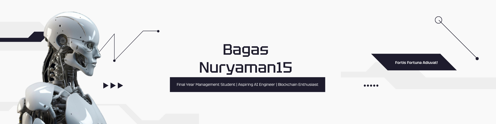

<!--My Banner Profile-->

  
  <b>ʜᴏʟᴀ, ɪ'ᴍ ʙᴀɢᴀꜱ ɴᴜʀʏᴀᴍᴀɴ</b>

 

<!--About Me Section-->
Currently wrapping up my Management degree at Universitas Islam Bandung, I'm all about diving deep into the worlds of business and economics.

But here's the fun part: outside of my major, I'm a huge tech enthusiast! After getting hooked on cryptocurrency (and the magic of Blockchain behind it) and Artificial Intelligence, I took a leap of faith. I joined a Machine Learning Engineering bootcamp at Dicoding Indonesia and an AI-Engineering bootcamp at Purwadhika.